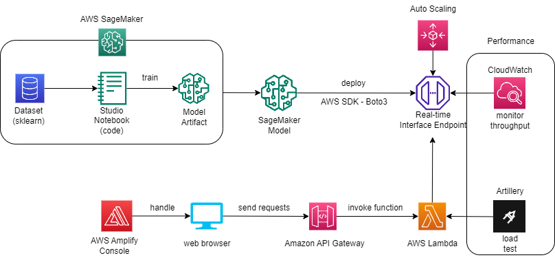

# IDS721-Team-Final-Project
In this project, we build a PaaS machine learning prediction model and deploy it on AWS SageMaker. We also use AWS Lambda to build a serverless backened and use Amazon API Gateway to expose the Lambda function as a RESTful API. AWS Amplify is configured to host static resources for our web application. We use Artillery and CloudWatch for load testing and monitoring. 

* Team members: Huilin Jin(hj146), Yuzhou Zhao(yz735), Zijia Jiang(zj68), Airu Song(as1134)
* [Click me to try our demo](https://master.d3saf47cr73tpe.amplifyapp.com/)
* Our project is mainly divided into three parts. The specific steps and codes are in the `./sagemaker`, `./lambda_api` and `./amplify_frontend` folders.
* Architecture

  

## Requirements
* Build a containerized or PaaS machine learning prediction model and deploy it in a scalable, and elastic platform:
  * Options:
    * ML Framework
      * Sklearn, MXNet, PyTorch or Keras/TF
    * Model
      * Your own supervised ML prediction model or a Kaggle Prediction Model
    * Platform
      * Flask + Kubernetes deployed to EKS (Elastic Kubernetes) or Google Kubernetes Engine
      * Flask + Google App Engine
      * AWS Sagemaker
      * Other (Upon Request)
* Verify Elastic Scale-Up Performance via Load Test with Locust, Loader.io, or a similar load test framework. (Start with 1 container or endpoint) and verify 2 or more inference endpoints scale up to 1K requests per second.

## Steps
* [Train and deploy model on AWS Sagemaker, and build AWS Sagemaker Realtime Inference Endpoint with Autoscaling Configurations](./sagemaker/)
* [API with Lambda function](./lambda_api/)
* [Frontend with AWS Amplified](./amplify_frontend/)

## Results

* Realtime Inference Sagemaker Endpoint that __scales up the number of instances__:
  
  * Load Test

    * Here, we use Artillery, which is a cloud-native and open source load-testing platform. 

      Load test with `artillery run ./script.yml`: [script.yml](lambda_api/script.yml)

      

    * We can also monitor endpoint performance on CloudWatch consoles. 
    
      

* Lambda Function with AWS API Gateway:

  Post your request to this api:
  https://gjtxc855a8.execute-api.us-east-1.amazonaws.com/DummyStage/DT

  

* Web app hosted in AWS Amplify:

  https://master.d3saf47cr73tpe.amplifyapp.com/

## Reference
* [load_wine dataset](https://scikit-learn.org/stable/modules/generated/sklearn.datasets.load_wine.html)
* [Deploy a Machine Learning Model to a Real-Time Inference Endpoint](https://aws.amazon.com/getting-started/hands-on/machine-learning-tutorial-deploy-model-to-real-time-inference-endpoint/?nc1=h_ls)
* [Load test and optimize an Amazon SageMaker endpoint using automatic scaling](https://aws.amazon.com/blogs/machine-learning/load-test-and-optimize-an-amazon-sagemaker-endpoint-using-automatic-scaling/)
* [Building and Load-Testing a Machine Learning Service](https://www.datacaptains.com/blog/building-and-load-testing-a-machine-learning-service)
* [artillery documentation](https://www.artillery.io/)
* [Build a Serverless Web Application](https://aws.amazon.com/getting-started/hands-on/build-serverless-web-app-lambda-apigateway-s3-dynamodb-cognito/)
* [Monitoring Endpoint Performance](https://catalog.us-east-1.prod.workshops.aws/workshops/44d3e2a0-ec6f-44df-9397-bcfdf129cadf/en-US/module-managing-the-production-deployment-5/monitoring-endpoint-performance-5-2)
