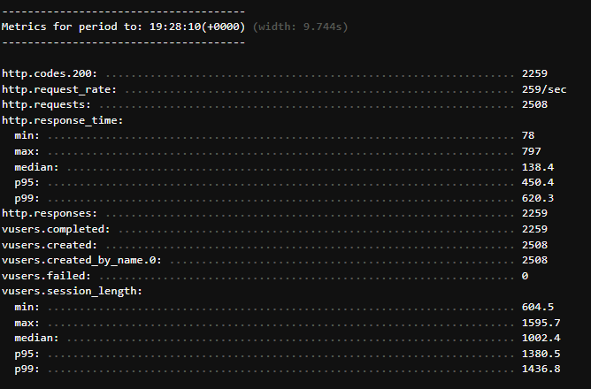

Main Reference for building Lambda API:

* [Load test and optimize an Amazon SageMaker endpoint using automatic scaling](https://aws.amazon.com/blogs/machine-learning/load-test-and-optimize-an-amazon-sagemaker-endpoint-using-automatic-scaling/)

Try invoke our API with postman:


To run loadtest, cd into the directory that contains [script.yml](script.yml), and run:

```
artillery run ./script.yml
```

Example Successful Result:

200 resonse status fills up most of the responses
