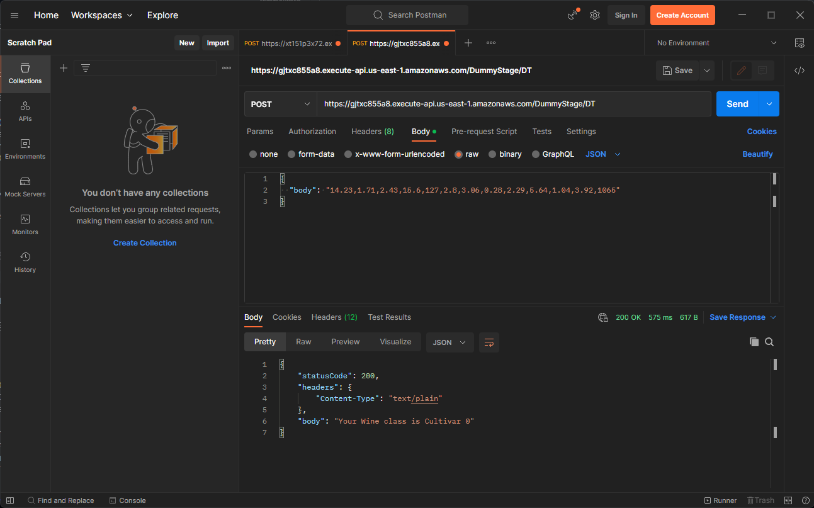

## Steps to build Lambda function with API Gateway trigger

1. Main Reference for building Lambda API:

    * [Load test and optimize an Amazon SageMaker endpoint using automatic scaling](https://aws.amazon.com/blogs/machine-learning/load-test-and-optimize-an-amazon-sagemaker-endpoint-using-automatic-scaling/)

2. Change CORS setting for our API to accept requests from different origins (domains). e.g. website hosted on cloud frontend service such as AWS Amplified

    i. In Lambda function, click the connected API Gateway
    
    

    ii. Select your API method in "Resources" tree, in "Actions" Dropdown Menu, click "Enable CORS"

    

    iii. Configure the CORS settings

    

    If CORS enabling failed, solve the problem using the given error text. 

    Problems encountered: Invalid Proxy settings
    
    Solution: go to your method under the resources tree. Click "Integration Request", unselect "use Lambda Proxy Integration". Then rerun 'Enable CORS'

3. Load test

    Try invoke our API with postman:
    


    To run loadtest, install artillery with `npm install -g artillery`. Then cd into the directory that contains [script.yml](script.yml) and run:

    ```
    artillery run ./script.yml
    ```

    Example Successful Result:

    200 resonse status fills up most of the responses
    